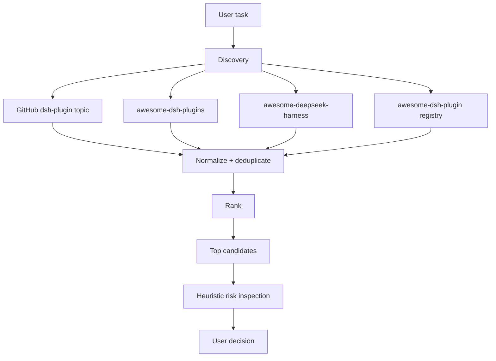

# dsh-capability-discovery

**Multi-source capability discovery, ranking, and heuristic risk inspection for DeepSeek Harness.**

`dsh-capability-discovery` is the **DSH Bundle** used for installation and loading. It registers the user-facing **`capability-discovery` Skill**, which finds useful DSH plugins, Agent Skills, MCP servers, profiles, agents, and related ecosystem projects without depending on a single directory.

> Independent community project. Not affiliated with or endorsed by DeepSeek.

[中文说明](./README.zh-CN.md) · [Architecture](./docs/architecture.md) · [Data sources](./docs/sources.md) · [Publishing](./docs/publishing.md) · [Contributing](./CONTRIBUTING.md) · [Security](./SECURITY.md) · [Changelog](./CHANGELOG.md)

## Why

The DeepSeek Harness ecosystem is distributed across GitHub topics, curated lists, and community registries. A human can browse all of them manually, but an Agent needs a smaller interface:

1. search multiple sources;
2. normalize and deduplicate the same repository;
3. rank results by task relevance, source agreement, activity, and lightweight popularity signals;
4. inspect the selected repository for known risk patterns;
5. let the user decide what to install.

This project focuses on that discovery layer.

## Architecture



A source failure does not fail the entire search. The response includes `sourceErrors` so partial coverage stays visible.

## Quick start

Requires Node.js 20 or newer.

### CLI from a local clone

```bash
git clone https://github.com/444136347/dsh-capability-discovery.git
cd dsh-capability-discovery
npm test

node cli/dsh-capability.mjs sources
node cli/dsh-capability.mjs search ppt slides --limit 5
node cli/dsh-capability.mjs search memory --type skill --json
node cli/dsh-capability.mjs inspect owner/repo
```

If the package is later published to npm, the same CLI can be exposed as `dsh-capability`.

## Use in DeepSeek Harness

The two names serve different roles:

| Name | Role |
|---|---|
| `dsh-capability-discovery` | DSH Bundle package installed into a profile |
| `capability-discovery` | Skill invoked inside a session |

The official CLI uses `dsh plugin` as the profile's external package-management entry point, so Bundles are installed through that subcommand; it does not mean the user-facing capability is a Web UI plugin. See the official [Bundle publishing tutorial](https://deepseek-harness.github.io/deepseek-harness/develop/basic/publish/) and [reference](https://deepseek-harness.github.io/deepseek-harness/reference/).

### 1. Install the Bundle

Pin a published tag or commit rather than following a moving branch. The current public release is `v0.1.0`:

```bash
npx -y @deepseek-ai/dsh plugin --profile web add \
  'github:444136347/dsh-capability-discovery#v0.1.0'
```

Current DSH releases add the package to `dependencies` and keep
`dsh.profile.bundles` in sync automatically. Verify the composed profile before booting:

```bash
npx -y @deepseek-ai/dsh --profile web --dump-config \
  | grep -n -C 4 -E 'dsh-capability-discovery|capability-discovery'
```

The output should contain the `# == dsh-capability-discovery` Bundle layer and the `dsh-capability-discovery` Loader entry. Profiles are independent: installing into `web` does not install the Bundle into `headless` or another profile.

### 2. Restart DSH

If DSH is already running, stop and restart the same profile after installing or upgrading the Bundle:

```bash
npx -y @deepseek-ai/dsh web
```

Refreshing the browser or creating a new session does not make an old process reload the Bundle set. At runtime, DSH only watches the profile-level `${DSH_HOME:-$HOME/.dsh}/profiles/<profile>/cordis.patch.yml` and home-level `${DSH_HOME:-$HOME/.dsh}/cordis.patch.yml` user patch files; changes to installed packages, `dsh.profile.bundles`, and a Bundle's own patch take effect on the next process start.

### 3. Invoke the Skill

In a new Web session, type `/cap` and pick `capability-discovery` from the `/` Skill menu, or send the full gesture directly:

```text
/capability-discovery Find up to three DSH plugins or Skills for creating presentation slides. Do not install anything.
```

The `/capability-discovery` gesture deterministically loads the Skill instructions before handling the rest of the task. Natural-language requests may also let the model select the Skill, but the explicit gesture is the clearest first verification after installation.

The default answer is compact Markdown: a direct conclusion, a table with at most three candidates, then source coverage and a no-installation status. The Skill combines related English terms into one search and may retry once with a different query only when the first search has no relevant candidates. Full source tables, commands, and diagnostics are shown only when explicitly requested; chat responses do not generate HTML by default.

More examples:

```text
/capability-discovery Find MCP management capabilities and disclose failed sources. Do not install anything.

/capability-discovery Search only for Skills that process Office files and compare the top three.

/capability-discovery Inspect STARDUSTLC666/dsh-ppt for risk. Do not install it.
```

The Bundle does not add a standalone Web UI page, settings card, or sidebar entry, but its Skill appears in the Web input's `/` menu.

### 4. Use the headless profile

Install the Bundle separately into `headless`, then invoke it in a one-shot task:

```bash
npx -y @deepseek-ai/dsh plugin --profile headless add \
  'github:444136347/dsh-capability-discovery#v0.1.0'

npx -y @deepseek-ai/dsh --profile headless \
  '/capability-discovery Find DSH capabilities for creating slides. Do not install anything.'
```

### 5. Troubleshoot a missing Skill

1. Confirm installation and startup use the same profile, such as `web`.
2. Run the `--dump-config` command above and verify the Bundle layer and Loader entry.
3. Stop the old DSH process and restart it; a browser refresh is not enough.
4. Create a session, type `/cap`, and verify that `capability-discovery` appears.
5. Bypass Skill loading and test the same CLI directly:

```bash
cd "${DSH_HOME:-$HOME/.dsh}/profiles/web"
pnpm exec dsh-capability search ppt --json
```

If the CLI works but the `/` menu does not contain the Skill, investigate the profile, Bundle composition, and process restart. If the CLI also fails, inspect `sourceErrors` and the network/proxy diagnostics.

Only for a legacy profile that already has the dependency but is missing the Bundle entry, run:

```bash
cd "${DSH_HOME:-$HOME/.dsh}/profiles/web"
pnpm exec dsh-capability setup --profile web
```

## CLI

### Search

```bash
dsh-capability search <keywords...> [--limit 10] [--type plugin|skill|mcp|profile|agent|orchestrator|ui|runtime|workflow] [--json]
```

The result includes:

- `score`: ranking score for the current query;
- `sources`: independent indexes that surfaced the repository;
- `type`: plugin / skill / MCP / profile / agent / runtime / UI / workflow when known;
- GitHub metadata such as stars, license, and recent activity when a source provides it;
- `sourceErrors`: sources that failed during this search.

### Inspect

```bash
dsh-capability inspect owner/repo [--json]
```

The inspector samples repository files and reports heuristic signals for:

- package lifecycle scripts;
- subprocess execution;
- credential- or environment-related access;
- network access;
- filesystem mutation;
- instruction-layer prompt-injection or exfiltration-like wording;
- dependency surface.

**This is not a security guarantee.** Static heuristics miss novel behavior, generated code, dependency behavior, runtime-loaded content, and files outside the scan sample.

The GitHub API automatically uses `GITHUB_TOKEN` or `GH_TOKEN` when either environment variable is set. A token increases the API rate limit and allows inspection of repositories that token can access; never paste a token into a command argument or commit it to the repository.

### List sources

```bash
dsh-capability sources --json
```

### Legacy profile repair

```bash
dsh-capability setup [--profile web] [--json]
```

This command only repairs an older profile where the package is already installed but missing from `dsh.profile.bundles`. Current DSH plugin commands maintain that list automatically. The repair command does not install packages or start DSH.

## Network reliability

- Network failures and HTTP `429`, `502`, `503`, and `504` responses are retried twice with exponential backoff.
- A valid `Retry-After` response header takes precedence over the default delay.
- Permanent HTTP responses such as `400`, `401`, `403`, and `404` are returned immediately without retrying.
- The three static Awesome List/Registry sources use a best-effort five-minute disk cache. GitHub keyword search remains live and is not cached.
- A source that still fails is preserved in `sourceErrors`; successful sources continue to contribute results.

The cache defaults to the operating system's temporary directory. Set `CAPABILITY_DISCOVERY_CACHE_DIR` to use a different directory. The variable intentionally does not use DSH's reserved `DSH_*` namespace, so it remains available to the Skill's CLI subprocess.

When DSH must use an HTTP proxy, make sure `HTTP_PROXY`/`HTTPS_PROXY` contain valid URLs. For Node.js fetch to honor those variables in supported Node.js releases, start DSH with `NODE_USE_ENV_PROXY=1`. Do not place proxy credentials in logs or issue reports.

## Ranking

v0.1 uses a deliberately simple, explainable score:

- task relevance has the largest weight;
- multiple independent sources add confidence;
- recent repository activity adds a freshness signal;
- stars add only a limited popularity signal;
- curated-list presence adds a small bonus.

The score is a recommendation aid, not a quality certificate.

## Capability types

| Type | v0.1 |
|---|---|
| DSH Plugin | Supported |
| Agent Skill | Supported |
| MCP Server | Supported when identified by an indexed source |
| Profile / Patch | Experimental classification |
| Agent / Orchestrator / Runtime / UI | Experimental classification |

## Data-source policy

No third-party repository data is bundled into this package. Public metadata is fetched at runtime from the configured sources; static catalogs may be retained in the five-minute temporary cache described above. See [docs/sources.md](./docs/sources.md).

If a source changes format or becomes unavailable, the other sources continue to work and the failure is surfaced to the caller.

## Project status

The current release is `v0.1.0`. It keeps the project focused on a small, auditable core without a database, hosted backend, account system, marketplace UI, or automatic installation workflow.

## Development

```bash
npm test
npm run check
npm pack --dry-run
```

The project uses Node's built-in test runner and has no runtime npm dependencies.

## License

Apache License 2.0. See [LICENSE](./LICENSE).

## Acknowledgements

This project queries or indexes public ecosystem metadata from community-maintained sources. Their data and repository contents remain governed by their respective terms. No source code from those projects is copied into this repository.
