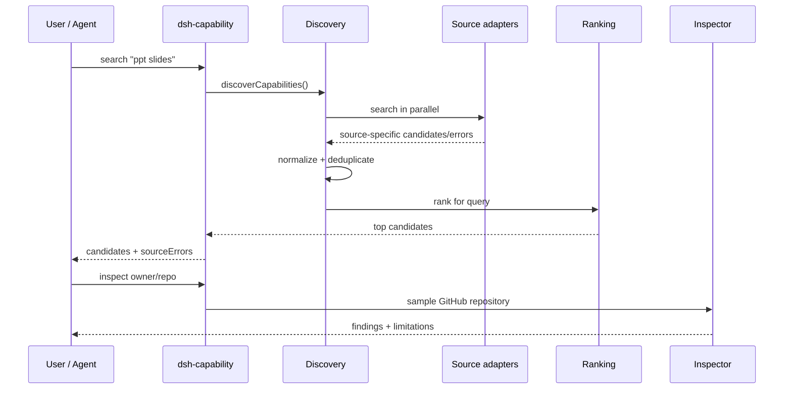

# Architecture

[中文](./architecture.zh-CN.md)

## Goals

`dsh-capability-discovery` keeps discovery logic independent from any single ecosystem directory. The core has four responsibilities:

1. **Adapters** fetch public metadata from independent sources.
2. **Normalization** turns source-specific records into one candidate shape.
3. **Ranking** scores candidates for the current query.
4. **Inspection** samples a selected GitHub repository for known risk patterns.

Installation is intentionally outside the discovery core.

## Data flow



## Candidate shape

A normalized candidate may contain:

```json
{
  "fullName": "owner/repo",
  "url": "https://github.com/owner/repo",
  "description": "...",
  "type": "plugin",
  "category": "...",
  "stars": 100,
  "pushedAt": "2026-08-17T00:00:00Z",
  "license": "MIT",
  "npmName": "package-name",
  "sources": ["source-a", "source-b"],
  "score": 72.5
}
```

Fields are optional when a source does not provide them.

## Source isolation

Each source exports a `name` and an async `search()` function. Discovery uses `Promise.all` with per-source error capture. One failing adapter therefore produces `sourceErrors` instead of failing the whole query.

The shared HTTP layer retries transient network failures and HTTP `429`, `502`, `503`, and `504` responses twice. Static Awesome List/Registry adapters also use a five-minute disk cache so separate CLI processes can reuse recent public catalog responses. The GitHub topic adapter remains uncached to preserve live keyword search behavior.

## Ranking

The ranking algorithm is deliberately deterministic and explainable. It does not call an LLM. This keeps the first-stage retrieval cheap and reproducible; an Agent can apply semantic judgment to the small top set afterwards.

## Inspection

The inspector fetches GitHub repository metadata, a recursive tree, and a bounded sample of source/instruction files. Pure pattern detection lives in `src/risk/scan.js`, separated from network access in `src/risk/inspect.js`, so the rules can be unit-tested without GitHub.

The inspection is a triage tool, not a sandbox or malware scanner.
