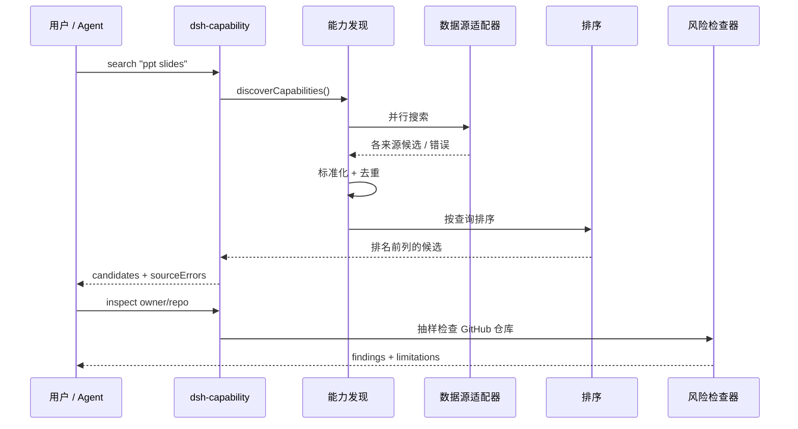

# 架构

[English](./architecture.md)

## 目标

`dsh-capability-discovery` 让能力发现逻辑不依赖任何单一生态目录。核心承担四项职责：

1. **适配器**：从彼此独立的数据源获取公开元数据。
2. **标准化**：把不同来源的记录转换成统一的候选结构。
3. **排序**：针对当前查询为候选能力评分。
4. **检查**：抽样读取选定的 GitHub 仓库，识别已知风险模式。

安装流程有意放在发现核心之外，搜索结果不会直接触发安装。

## 数据流



## 候选结构

标准化后的候选可能包含以下字段：

```json
{
  "fullName": "owner/repo",
  "url": "https://github.com/owner/repo",
  "description": "...",
  "type": "plugin",
  "category": "...",
  "stars": 100,
  "pushedAt": "2026-08-17T00:00:00Z",
  "license": "MIT",
  "npmName": "package-name",
  "sources": ["source-a", "source-b"],
  "score": 72.5
}
```

某个数据源没有提供对应信息时，相关字段可以缺省。

## 数据源隔离

每个数据源导出 `name` 和异步 `search()` 函数。发现流程使用 `Promise.all` 并单独捕获每个来源的错误，因此一个适配器失败只会产生 `sourceErrors`，不会让整次查询失败。

共享 HTTP 层会对临时网络故障和 HTTP `429`、`502`、`503`、`504` 响应重试两次。GitHub 静态适配器会先尝试官方 Contents API，再回退到 Raw 域名，同时仍然只产生一个逻辑数据源结果。静态 Awesome List / Registry 适配器还使用 5 分钟磁盘缓存，让不同 CLI 进程可以复用近期获取的公开目录。GitHub Topic 适配器不使用缓存，以保留实时关键词搜索行为。

## 排序

排序算法刻意保持确定、可解释，并且不调用 LLM。这样第一阶段检索成本低且能够复现，Agent 再对少量排名靠前的候选应用语义判断。

## 风险检查

检查器会获取 GitHub 仓库元数据、递归文件树，并读取数量受限的源码和指令文件样本。纯模式检测位于 `src/risk/scan.js`，网络访问位于 `src/risk/inspect.js`，因此检测规则可以在不访问 GitHub 的情况下进行单元测试。

风险检查只是初步筛查工具，不是沙箱、恶意软件扫描器或安全认证。
